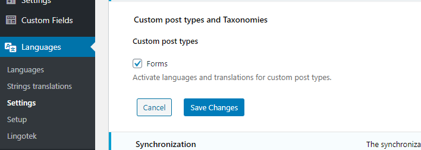

# Frequently asked questions

## Multisite (WordPress Network) support

**NOTE: Multisite support has not been tested with 2.0. It's probably just the same but there's no way to know before someone tests it. The restrictions in place to prevent unworthy users from editing are better in 2.0.**

WP Libre Form works fine in WordPress Network (multisite). There's some gotchas:

- Plugin must be activated in each site, not on network level
- Only Super Admins can edit forms.
  - This is because Network strips dangerous input like iframes & input fields from the content.
  - Can be worked around by installing [Unfiltered MU](https://wordpress.org/plugins/unfiltered-mu/)

## Single page applications and other REST API driven sites

No problem. There's an API available at /wp-json/wplf/v2/. We don't use the standard endpoint that comes with the form post type.

Install `@libreform/libreform` from npm and you're pretty much good to go.

If you run into CORS issues with the API because you're sending submissions from a different URL than what WordPress is located at, you might need to setup some access-control headers.

Here's one solution to those.

```php

// source: https://dev.to/robmarshall/wordpress-rest-api-cors-issues-13p7

add_action('init', 'handle_preflight');
function handle_preflight() {
    $origin = get_http_origin();
    if ($origin === 'https://yourfrontenddomain') {
        header("Access-Control-Allow-Origin: yourfrontenddomain");
        header("Access-Control-Allow-Methods: POST, GET, OPTIONS, PUT, DELETE");
        header("Access-Control-Allow-Credentials: true");
        header('Access-Control-Allow-Headers: Origin, X-Requested-With, X-WP-Nonce, Content-Type, Accept, Authorization');
        if ('OPTIONS' == $_SERVER['REQUEST_METHOD']) {
            status_header(200);
            exit();
        }
    }
}

add_filter('rest_authentication_errors', 'rest_filter_incoming_connections');
function rest_filter_incoming_connections($errors) {
    $request_server = $_SERVER['REMOTE_ADDR'];
    $origin = get_http_origin();
    if ($origin !== 'https://yourfrontenddomain') return new WP_Error('forbidden_access', $origin, array(
        'status' => 403
    ));
    return $errors;
}
```

## Uncaught ReferenceError: WPLF is not defined

The form script is enqueued when a form is rendered. If there isn't a form on the page, window.WPLF isn't available. Either install the npm package or make your script depend on wplf-frontend;

```php
wp_enqueue_script('yourscript', $pathToScript, ['wplf-frontend'], $version, true);
```

## Multilingual

We've made special efforts to ensure compatibility with Polylang. WPML is not supported.

Enable translation of Forms in Polylang settings. You're good to go! If you don't enable it, your forms will not have a language, and translations might not work.



We have a special `## PLL__ YourStringHere ##` selector that you can use in your forms. After using the selector in a form, you should see it in the string translations menu of Polylang.


Using the selector for all translated content in your form lets you synchronize the same form between all languages, making future edits easier.

**Tip:** Use a selector for the success message and enable Custom fields sync in Polylang settings (Under Custom post types and Taxonomies).

_Please note that the selector might not work in the admin preview of the form, and you might see the labels instead of the translations. Don't be alarmed, if the form works on the frontend, everything is fine. This is a harmless bug that we've tried hunting down for ages._

[See issue.](https://github.com/libreform/libreform/issues/9)

## Adding extra classes to the form element

You can use the className attribute inside the shortcode to add your own extra classes for CSS.

```
[libreform id="1" className="extra"]
```

## Adding extra attributes to the form element

You can add other custom attributes to the form element easily by adding them to the shortcode

```
[libreform id="1" data-custom-attr="contactme"]
```

The attribute will render as is on the `<form>` element

```html
<form class="wplf libreform-1" data-custom-attr="contactme"></form>
```

## Importing forms from a predefined template

Sometimes a project might require static forms which are not supposed to
be editable in the admin panel.

We allow you to define HTML forms in your project source code
and import them into the admin for specific forms.

Remember: WPLF will insert `form` tags on its own, meaning you only have
to create the markup which sits directly inside the `form` tags.

### Importing a template into WPLF

Once you're done creating a form template, you need to inform
WPLF about it. You can use the `wplfImportFormTemplate` filter for this:

```php
add_filter('wplfImportFormTemplate', function($template, \WPLF\Form $form) {

  if ($form->ID === 666) {
    return '<input type="text" name="helloworld">';
  }

  return $template;
}, 10, 2);
```

The `$template` variable should be a raw HTML string. If it is set to
`null` no template will be imported.

After a template is imported, it can't be edited from the admin. Success message and the like are still configurable from there though.

**After making changes to the form template or importing it for the first time, it's crucial that you go to the form in admin, and press the Update button.** Otherwise your form will not have the database columns necessary to save the data. The form field data is extracted on clientside, and at this point in time, this is the only reliable way to get it done.

_In theory you should be able to call `$form->setFields()` and `libreform()->afterSavePost($form->ID, $form, true)` to get it done, but then you'd have to figure something to only run it once._
